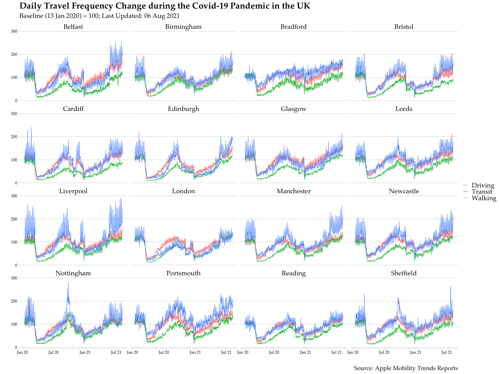
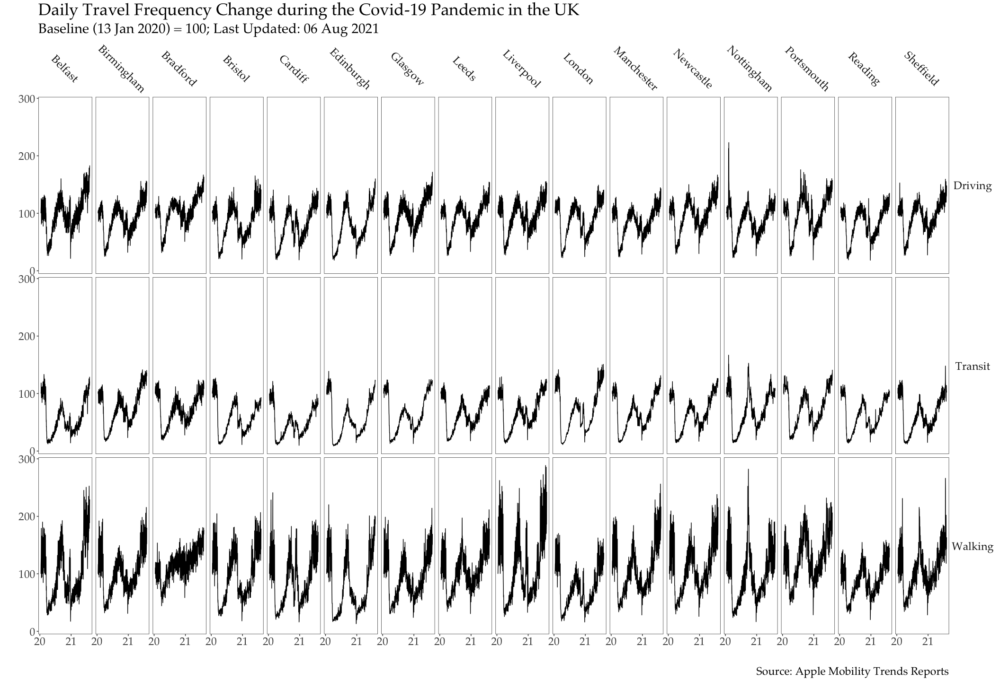

R Tips for the 2021 Essex Summer School
================

``` r
library(cowplot)
library(extrafont)
library(haven)
library(lubridate)
library(magrittr)
library(tidyverse)
```

    ## [1] "R version 4.1.0 (2021-05-18)" "macOS Big Sur 10.16"

## 1 Reshape

This section introduces the `tidyverse` way of reshaping rectangular data.

We use the [Apple Mobility Trends Reports](https://covid19.apple.com/mobility) to see how travel frequency changes during the COVID-19 pandemic across the UK. After loading the packages, we import the CSV file using its URL and subset the data to cities in the UK only.

``` r
uk_mobility_raw <- read_csv("https://covid19-static.cdn-apple.com/covid19-mobility-data/2114HotfixDev8/v3/en-us/applemobilitytrends-2021-08-06.csv") %>%
  filter(country == "United Kingdom", geo_type == "city") %>%
  transmute(region, transportation_type, across(c(`2020-01-13`:ncol(.))))
```

    ## # A tibble: 48 x 574
    ##    region    transportation_ty… `2020-01-13` `2020-01-14` `2020-01-15` `2020-01-16` `2020-01-17` `2020-01-18` `2020-01-19` `2020-01-20` `2020-01-21` `2020-01-22` `2020-01-23` `2020-01-24` `2020-01-25`
    ##    <chr>     <chr>                     <dbl>        <dbl>        <dbl>        <dbl>        <dbl>        <dbl>        <dbl>        <dbl>        <dbl>        <dbl>        <dbl>        <dbl>        <dbl>
    ##  1 Belfast   driving                     100         108.         112.        124.         126.         121.          81.2        106.          111.         117.         111.        124.         121. 
    ##  2 Belfast   transit                     100         100.         104.        118.         114.         104.          92.7        104.          102.         107.         100.        111.         106. 
    ##  3 Belfast   walking                     100         117.         123.        128.         148.         179.          93.0        122.          127.         129.         120.        152.         166. 
    ##  4 Birmingh… driving                     100         104.         103.        104.         105.         103.          85.8        104.          108.         106.         107.        110.         106. 
    ##  5 Birmingh… transit                     100         102.         104.        101.          97.5         87.2         83.1        102.          103.         107.         101.         99.9         90.5
    ##  6 Birmingh… walking                     100         108.         116.        111.         125.         161.          98.3        113.          121.         126.         124.        146.         192. 
    ##  7 Bradford  driving                     100         106.         108.        104.         108.         106.          92.6        100.          104          116.         106.        113.         106. 
    ##  8 Bradford  transit                     100         107.         109.        112.         102.          98.5        101.         109.          116.         118.         113.        101.          96.4
    ##  9 Bradford  walking                     100         110.         111.         99.7        119.         120.          91.9         94.8         100.         112.         103.        107.         120. 
    ## 10 Bristol   driving                     100         104.         101.        102.         105.         104.          85.8         98.1         103.         104.         103.        112.         113. 
    ## # … with 38 more rows, and 559 more variables: 2020-01-26 <dbl>, 2020-01-27 <dbl>, 2020-01-28 <dbl>, 2020-01-29 <dbl>, 2020-01-30 <dbl>, 2020-01-31 <dbl>, 2020-02-01 <dbl>, 2020-02-02 <dbl>,
    ## #   2020-02-03 <dbl>, 2020-02-04 <dbl>, 2020-02-05 <dbl>, 2020-02-06 <dbl>, 2020-02-07 <dbl>, 2020-02-08 <dbl>, 2020-02-09 <dbl>, 2020-02-10 <dbl>, 2020-02-11 <dbl>, 2020-02-12 <dbl>,
    ## #   2020-02-13 <dbl>, 2020-02-14 <dbl>, 2020-02-15 <dbl>, 2020-02-16 <dbl>, 2020-02-17 <dbl>, 2020-02-18 <dbl>, 2020-02-19 <dbl>, 2020-02-20 <dbl>, 2020-02-21 <dbl>, 2020-02-22 <dbl>,
    ## #   2020-02-23 <dbl>, 2020-02-24 <dbl>, 2020-02-25 <dbl>, 2020-02-26 <dbl>, 2020-02-27 <dbl>, 2020-02-28 <dbl>, 2020-02-29 <dbl>, 2020-03-01 <dbl>, 2020-03-02 <dbl>, 2020-03-03 <dbl>,
    ## #   2020-03-04 <dbl>, 2020-03-05 <dbl>, 2020-03-06 <dbl>, 2020-03-07 <dbl>, 2020-03-08 <dbl>, 2020-03-09 <dbl>, 2020-03-10 <dbl>, 2020-03-11 <dbl>, 2020-03-12 <dbl>, 2020-03-13 <dbl>,
    ## #   2020-03-14 <dbl>, 2020-03-15 <dbl>, 2020-03-16 <dbl>, 2020-03-17 <dbl>, 2020-03-18 <dbl>, 2020-03-19 <dbl>, 2020-03-20 <dbl>, 2020-03-21 <dbl>, 2020-03-22 <dbl>, 2020-03-23 <dbl>,
    ## #   2020-03-24 <dbl>, 2020-03-25 <dbl>, 2020-03-26 <dbl>, 2020-03-27 <dbl>, 2020-03-28 <dbl>, 2020-03-29 <dbl>, 2020-03-30 <dbl>, 2020-03-31 <dbl>, 2020-04-01 <dbl>, 2020-04-02 <dbl>,
    ## #   2020-04-03 <dbl>, 2020-04-04 <dbl>, 2020-04-05 <dbl>, 2020-04-06 <dbl>, 2020-04-07 <dbl>, 2020-04-08 <dbl>, 2020-04-09 <dbl>, 2020-04-10 <dbl>, 2020-04-11 <dbl>, 2020-04-12 <dbl>,
    ## #   2020-04-13 <dbl>, 2020-04-14 <dbl>, 2020-04-15 <dbl>, 2020-04-16 <dbl>, 2020-04-17 <dbl>, 2020-04-18 <dbl>, 2020-04-19 <dbl>, 2020-04-20 <dbl>, 2020-04-21 <dbl>, 2020-04-22 <dbl>,
    ## #   2020-04-23 <dbl>, 2020-04-24 <dbl>, 2020-04-25 <dbl>, 2020-04-26 <dbl>, 2020-04-27 <dbl>, 2020-04-28 <dbl>, 2020-04-29 <dbl>, 2020-04-30 <dbl>, 2020-05-01 <dbl>, 2020-05-02 <dbl>,
    ## #   2020-05-03 <dbl>, 2020-05-04 <dbl>, …

### `pivot_longer`

The data is in wide format. But data analysis oftentimes requires long format, by which repeatedly measured values are stacked while a dedicated column stores the time information.

`tidyr::pivot_longer()` converts rectangular data from wide to long format. When using this function, we generally need to specify the columns that are about to be stacked.

``` r
uk_mobility_by_type <- uk_mobility_raw %>%
  pivot_longer(`2020-01-13`:ncol(.))
```

    ## # A tibble: 27,456 x 4
    ##    region  transportation_type name       value
    ##    <chr>   <chr>               <chr>      <dbl>
    ##  1 Belfast driving             2020-01-13 100  
    ##  2 Belfast driving             2020-01-14 108. 
    ##  3 Belfast driving             2020-01-15 112. 
    ##  4 Belfast driving             2020-01-16 124. 
    ##  5 Belfast driving             2020-01-17 126. 
    ##  6 Belfast driving             2020-01-18 121. 
    ##  7 Belfast driving             2020-01-19  81.2
    ##  8 Belfast driving             2020-01-20 106. 
    ##  9 Belfast driving             2020-01-21 111. 
    ## 10 Belfast driving             2020-01-22 117. 
    ## # … with 27,446 more rows

We can specify the names of new columns (`name` and `value`) by using two additional arguments. They further imply how the function works: it temporally expands each row in the wide data to *T* rows in the long data and uses the column names to identify which rows correspond to which column.

``` r
uk_mobility_by_type <- uk_mobility_raw %>%
  pivot_longer(`2020-01-13`:ncol(.), names_to = "date", values_to = "traffic")
```

We can use [selection helpers](https://dplyr.tidyverse.org/reference/select.html) to specify the columns to stack.

``` r
uk_mobility_raw %>% pivot_longer(starts_with("20"))
uk_mobility_raw %>% pivot_longer(contains("20"))
```

### `pivot_wider`

Although the data is now stacked temporally, the unit of observation is `city`-`transportation_type`-`date`, so we want to have three separate variables (columns) for three specific types of transportation (driving, transit, and walking). `pivot_wider()` does the opposite of `pivot_longer()`.

``` r
uk_mobility_panel <- uk_mobility_by_type %>%  
  pivot_wider(names_from = "transportation_type", values_from = "traffic")
```

    ## # A tibble: 9,152 x 5
    ##    region  date       driving transit walking
    ##    <chr>   <chr>        <dbl>   <dbl>   <dbl>
    ##  1 Belfast 2020-01-13   100     100     100  
    ##  2 Belfast 2020-01-14   108.    100.    117. 
    ##  3 Belfast 2020-01-15   112.    104.    123. 
    ##  4 Belfast 2020-01-16   124.    118.    128. 
    ##  5 Belfast 2020-01-17   126.    114.    148. 
    ##  6 Belfast 2020-01-18   121.    104.    179. 
    ##  7 Belfast 2020-01-19    81.2    92.7    93.0
    ##  8 Belfast 2020-01-20   106.    104.    122. 
    ##  9 Belfast 2020-01-21   111.    102.    127. 
    ## 10 Belfast 2020-01-22   117.    107.    129. 
    ## # … with 9,142 more rows

The data finally has a typical panel structure -- an *NT* × *K* matrix, in which *N* refers to the cross-sectional sample size (16 cities), *T* refers to the time-series sample size (572 days), and *K* refers to the number of variables, which is identical to the number of columns.

## 2 Date and String

This section introduces the `tidyverse` way of working with date and string. Although `uk_mobility_panel` is how typical social science panel data looks like, we use `uk_mobility_by_type` from now on for convenient Grouped Visualization (section 5).

### `lubridate`

Working with date as `numeric` or `character` when we only have yearly data is oftentimes fine. But it is better to set date as `date` when the temporal frequency becomes higher. Doing so ensures time-series operations are done correctly and enables us to easily extract some additional time information. Our `date` column's format is YYYY-MM-DD, so we use `lubridate::ymd()` to transform `date` from `character` to `date`.

``` r
# %<>% from magrittr (not recommended by many) is used to save space
uk_mobility_by_type %<>% mutate(date = ymd(date))
```

Likewise, we also have `mdy()` and `dmy()`. These functions handles both `numeric` and `character` objects and are versatile to detailed format differences, such as whether month is spelled out, if leading zero is included, and so on.

``` r
mdy(8102021); mdy("Jan 13 01"); dmy("1/07/1935"); dmy("1st in September in the year of 2021")
```

    ## [1] "2021-08-10"

    ## [1] "2001-01-13"

    ## [1] "1935-07-01"

    ## [1] "2021-09-01"

We may suspect that daily travel frequency is correlated with whether a day is during weekend and daylight saving time. The following two functions extract such information and create two new variables accordingly.

``` r
uk_mobility_by_type %>% mutate(
  which_day = wday(date, label = TRUE),
  daylight_saving = dst(date)
  )
```

    ## # A tibble: 27,456 x 6
    ##    region  transportation_type date       traffic which_day daylight_saving
    ##    <chr>   <chr>               <date>       <dbl> <ord>     <lgl>          
    ##  1 Belfast driving             2020-01-13   100   Mon       FALSE          
    ##  2 Belfast driving             2020-01-14   108.  Tue       FALSE          
    ##  3 Belfast driving             2020-01-15   112.  Wed       FALSE          
    ##  4 Belfast driving             2020-01-16   124.  Thu       FALSE          
    ##  5 Belfast driving             2020-01-17   126.  Fri       FALSE          
    ##  6 Belfast driving             2020-01-18   121.  Sat       FALSE          
    ##  7 Belfast driving             2020-01-19    81.2 Sun       FALSE          
    ##  8 Belfast driving             2020-01-20   106.  Mon       FALSE          
    ##  9 Belfast driving             2020-01-21   111.  Tue       FALSE          
    ## 10 Belfast driving             2020-01-22   117.  Wed       FALSE          
    ## # … with 27,446 more rows

### `stringr`

With `uk_mobility_by_type` on hand, we now want to join it with the UK COVID-19 data. We import an CSV file for *New Cases by Publish Date* in Upper Tier Local Authorities (UTLA).

``` r
uk_covid <- read_csv("https://api.coronavirus.data.gov.uk/v2/data?areaType=utla&metric=newCasesByPublishDate&format=csv&release=2021-08-11")
```

    ## # A tibble: 97,307 x 5
    ##    areaCode  areaName                  areaType date       newCasesByPublishDate
    ##    <chr>     <chr>                     <chr>    <date>                     <dbl>
    ##  1 E06000003 Redcar and Cleveland      utla     2021-08-11                    78
    ##  2 E06000014 York                      utla     2021-08-11                   112
    ##  3 E06000050 Cheshire West and Chester utla     2021-08-11                   116
    ##  4 E08000001 Bolton                    utla     2021-08-11                    77
    ##  5 E08000016 Barnsley                  utla     2021-08-11                   129
    ##  6 E08000031 Wolverhampton             utla     2021-08-11                   142
    ##  7 E08000032 Bradford                  utla     2021-08-11                   286
    ##  8 E09000018 Hounslow                  utla     2021-08-11                   105
    ##  9 E09000032 Wandsworth                utla     2021-08-11                   141
    ## 10 E09000033 Westminster               utla     2021-08-11                    95
    ## # … with 97,297 more rows

To join data, identical row identifiers have to be present in the two datasets. `uk_mobility_by_type` does not have any standardized, code-based identifier, so we have to use city names instead. However, in `uk_covid`, Bristol is named as "Bristol, City of", Edinburgh is named as "City of Edinburgh", and Glasgow is named as "Glasgow City." The code below uses `stringr::str_detect()` to modify `areaName` (to be matched to `region` in `uk_mobility_by_type` later) in `uk_covid` according to the following rule: for the observations whose `areaName` includes the string `"Bristol"`, change the `areaName` to `"Bristol"`; for the observations whose `areaName` includes the string `"Edinburgh"`, change the `areaName` as `"Edinburgh"`; for the observations whose `areaName` includes the string `"Glasgow"`, change the `areaName` to `"Glasgow"`; for the observations that do not meet any of these conditions, keep their `areaName` unchanged.

``` r
uk_covid %<>% mutate(areaName = case_when(
  str_detect(areaName, "Bristol") ~ "Bristol",
  str_detect(areaName, "Edinburgh") ~ "Edinburgh",
  str_detect(areaName, "Glasgow") ~ "Glasgow",
  TRUE ~ areaName
  ))
```

London is a single statistical unit in `uk_mobility_by_type`, but `uk_covid` provides the data for London's 32 boroughs plus the City of London separately. These 33 London districts have one thing in common, though: their `areaCode` all starts with the string `"E09"`. The code below does the following: for the observations whose `areaCode` starts with the string `"E09"`, change their `areaName` to London; for the else observations, keep their `areaName` unchanged. Compared to the last chunk which changes `areaName` conditional on itself (`areaName`), this one changes `areaName` conditional on another column (`areaCode`).

``` r
uk_covid %<>% mutate(areaName = if_else(str_starts(areaCode, "E09"), "London", areaName))
```

The `stringr` package also have four style changers.

``` r
example_str <- "The `stringr` package also have four style changers"
str_to_lower(example_str); str_to_title(example_str); str_to_upper(example_str); str_to_upper(example_str) %>% str_to_sentence()
```

    ## [1] "the `stringr` package also have four style changers"

    ## [1] "The `Stringr` Package Also Have Four Style Changers"

    ## [1] "THE `STRINGR` PACKAGE ALSO HAVE FOUR STYLE CHANGERS"

    ## [1] "The `stringr` package also have four style changers"

``` r
uk_mobility_by_type %<>% mutate(transportation_type = str_to_title(transportation_type))
```

## 3 Within-Group Operation

`uk_mobility_by_type` and `uk_covid` are panel data. Further, in `uk_mobility_by_type`, `transportation_type` is within each `region`-`date`. This section introduces the `tidyverse` way of doing within-group operations.

### `group_by`

`uk_mobility_type` does not have data for three days. Given we only have a few missing values relative to the large temporal sample size, we decide to carry past values forward to impute them.

    ## # A tibble: 144 x 4
    ##    region     transportation_type date       traffic
    ##    <chr>      <chr>               <date>       <dbl>
    ##  1 Belfast    Driving             2020-05-11      NA
    ##  2 Belfast    Driving             2020-05-12      NA
    ##  3 Belfast    Driving             2021-03-12      NA
    ##  4 Belfast    Transit             2020-05-11      NA
    ##  5 Belfast    Transit             2020-05-12      NA
    ##  6 Belfast    Transit             2021-03-12      NA
    ##  7 Belfast    Walking             2020-05-11      NA
    ##  8 Belfast    Walking             2020-05-12      NA
    ##  9 Belfast    Walking             2021-03-12      NA
    ## 10 Birmingham Driving             2020-05-11      NA
    ## # … with 134 more rows

But unless correctly grouping `uk_mobility_by_type` in R, we may use, say, London's value at *t-1* for Glasgow's missing value at *t* or use Walking at *t-1* for the missing Driving at *t*. `uk_mobility_by_type` has three levels (`region`, `transportation_type`, `date`), whereas for filling the missing values, we only need to operate across `date`. So, we group `uk_mobility_by_type` by `region` and `transportation_type` to `tidyr::fill()` within each `transportation_type` of each `city`.

``` r
uk_mobility_by_type %<>%
  group_by(region, transportation_type) %>%
  fill(traffic) %>%
  ungroup()
```

The chunk below shows a part of the filled data.

    ## # A tibble: 240 x 4
    ##    region  transportation_type date       traffic
    ##    <chr>   <chr>               <date>       <dbl>
    ##  1 Belfast Driving             2021-03-10    91.8
    ##  2 Belfast Driving             2021-03-11    95.3
    ##  3 Belfast Driving             2021-03-12    95.3
    ##  4 Belfast Driving             2021-03-13   110. 
    ##  5 Belfast Driving             2021-03-14    72.3
    ##  6 Belfast Transit             2021-03-10    37.5
    ##  7 Belfast Transit             2021-03-11    36.2
    ##  8 Belfast Transit             2021-03-12    36.2
    ##  9 Belfast Transit             2021-03-13    44.2
    ## 10 Belfast Transit             2021-03-14    27.5
    ## # … with 230 more rows

Although we can apply time-series operators during estimation (using `plm::plm()`, for example), sometimes we may want to temporally transform our variables prior to it. `dplyr` has some functions to perform basic time-series operations, but again, we need to make sure that we `group_by()` correctly.

``` r
uk_mobility_by_type %>%
  group_by(city, transportation_type) %>%
  mutate(
    traffic_lag = dplyr::lag(traffic),
    traffic_lag2 = dplyr::lag(traffic, 2),
    traffic_lead = dplyr::lead(traffic),
    traffic_diff = traffic - dplyr::lag(traffic)
  ) %>%
  ungroup()
```

### `group_by` and `summarize`

We can further use `dplyr::summarize()` after `group_by()` to aggregate our data, according to the aggregation method we specify, to the level(s) we set. In other words, we collapse all observations within the specified group to a single one. In section 2, although we rename 33 London districts as London in `uk_covid`, London within each `date` still has 33 observations for its 33 districts. The code below sums 33 `newCasesByPublishDate` of London's 33 districts together for everyday. After that, London only has a single observation for itself as a whole on a given day, just like all other cities do.

``` r
uk_covid %<>% group_by(areaName, date) %>%
  summarize(newCasesByPublishDate = sum(newCasesByPublishDate)) %>%
  ungroup()
```

`summarize()` is useful to show unit-specific summary statistics. If we `group_by(areaName)` and then `summarize()`, we can easily have cumulative statistics of `newCasesByPublishDate` for each area. The code below lets us know the 10 UK Upper Tier Local Authorities with the most and least total COVID-19 cases.

``` r
uk_covid %>% group_by(areaName) %>%
  summarize(total_cases = sum(newCasesByPublishDate)) %>%
  arrange(desc(total_cases))
```

    ## # A tibble: 183 x 2
    ##    areaName      total_cases
    ##    <chr>               <dbl>
    ##  1 London             911222
    ##  2 Essex              144345
    ##  3 Lancashire         142078
    ##  4 Kent               141630
    ##  5 Birmingham         134580
    ##  6 Hertfordshire      104674
    ##  7 Leeds               94144
    ##  8 Surrey              93297
    ##  9 Hampshire           89092
    ## 10 Staffordshire       80036
    ## # … with 173 more rows

``` r
uk_covid %>% group_by(areaName) %>%
  summarize(total_cases = sum(newCasesByPublishDate)) %>%
  arrange(total_cases)
```

    ## # A tibble: 183 x 2
    ##    areaName           total_cases
    ##    <chr>                    <dbl>
    ##  1 Orkney Islands             164
    ##  2 Shetland Islands           363
    ##  3 Na h-Eileanan Siar         463
    ##  4 Ceredigion                2199
    ##  5 Rutland                   2452
    ##  6 Moray                     2469
    ##  7 Argyll and Bute           2537
    ##  8 Isle of Anglesey          2687
    ##  9 Clackmannanshire          3424
    ## 10 Pembrokeshire             4025
    ## # … with 173 more rows

## 4 Join Data by Rows

This section introduces the `tidyverse` way of joining data. First, we `rename` `areaName` in `uk_covid` as `region` so that row identifiers in the two datasets have the same name.

``` r
uk_covid %<>% rename(region = areaName)
```

### `left_join`

The primary difference between various `dplyr` functions for joining data is how they deal with unmatched observations. In our example, `uk_mobility_by_type` only has 16 cities while `uk_covid` includes all Upper Tier Local Authorities in the country. Thus, the majority of observations in `uk_covid` cannot be matched. For `left_join(x, y)`, all observation in `x` remains but all unmatched observations in `y` are dropped. In comparison, for `left_join(y, x)`, all observations in `y` remains but all unmatched observations in `x` are dropped. Clearly, when applying `left_join()`, changing the relative position of the two datasets gives us opposite results. As we can see from the chunk below, when `uk_mobility_by_type` is on the left, the returned data only 16 regions since all regions in `uk_covid` but not included in `uk_mobility_by_type` are excluded from the joined data. In the opposite, all regions, no matter whether they in `uk_mobility_by_type` or not, are kept when `uk_covid` is on the left.

``` r
left_join(uk_mobility_by_type, uk_covid, by = c("region", "date")) %>% summarize(n_distinct(region))
```

    ## # A tibble: 1 x 1
    ##   `n_distinct(region)`
    ##                  <int>
    ## 1                   16

``` r
left_join(uk_covid, uk_mobility_by_type, by = c("region", "date")) %>% summarize(n_distinct(region))
```

    ## # A tibble: 1 x 1
    ##   `n_distinct(region)`
    ##                  <int>
    ## 1                  183

### `right_join`

For `right_join(x, y)`, all observation in `y` remains but all unmatched observations in `x` are dropped. Obviously, the result of `right_join()` is opposite to what `left_join()` returns. Actually, `left_join(x, y)` equals `right_join(y, x)` while `left_join(y, x)` equals `right_join(x, y)`, holding all other arguments constant.

``` r
right_join(uk_mobility_by_type, uk_covid, by = c("region", "date")) %>% summarize(n_distinct(region))
```

    ## # A tibble: 1 x 1
    ##   `n_distinct(region)`
    ##                  <int>
    ## 1                  183

``` r
right_join(uk_covid, uk_mobility_by_type, by = c("region", "date")) %>% summarize(n_distinct(region))
```

    ## # A tibble: 1 x 1
    ##   `n_distinct(region)`
    ##                  <int>
    ## 1                   16

### `full_join`

Neither of the four function shown above maximizes the number of observations kept in the joined data. We try to join the data on two dimensions (`region` and `date`), but in fact, the data with most regions (`uk_covid`) has fewer days. To keep as many observations as possible in the merged data, we can then use `full_join()`, which drops nothing.

``` r
full_join(uk_mobility_by_type, uk_covid, by = c("region", "date")) %>% summarize(n_distinct(region), n_distinct(date))
```

    ## # A tibble: 1 x 2
    ##   `n_distinct(region)` `n_distinct(date)`
    ##                  <int>              <int>
    ## 1                  183                577

``` r
uk_mobility_covid <- left_join(uk_mobility_by_type, uk_covid, by = c("region", "date")) # this is our finally joined data
```

## 5 Grouped Visualization

This section introduces the `tidyverse` way of making grouped visualization. Specifically, we want a time-series plot showing the travel frequency change (`traffic`) by three `transportation_type` by 16 cities (`region`).

### inside `aes()` and `facet_wrap`

If we simply used `geom_line(aes(date, traffic))`, then we would have 48 lines wrapped together. To distinguish different `transportation_type`, we can use the aesthetics specific to `transportation_type`. In the code below, three lines for each `transportation_type` are assigned to unique colors to make them mutually distinguishable (`color = transportation_type`). Alternatively, we can use `linetype = transportation_type` (straight, dotted, dashed, etc.). But given the three lines are close to each other, that is not the preferred method. Similarly, we can apply this sort of grouping setting to other types of plots. If we do a scatter plot (`geom_point()`), for example, we can use different `shape` for different groups.

We can then use `facet_wrap()` to have a figure with multiple panels. Here, we specify `vars(region)` to let panels represent different `region`. Given we have 16 cities, 4 × 4 is a natural choice regarding how many should be along rows and columns. However, we are allowed to adjust these parameters by setting `nrow` or `ncol` inside of `facet_wrap()`.

``` r
uk_mobility_covid %>% ggplot() + 
  geom_line(aes(date, traffic, group = transportation_type, color = transportation_type)) +
  facet_wrap(vars(region)) +
  scale_x_date(date_labels="%b %y") +
  labs(
    x = "",
    y = "", 
    title = "Daily Travel Frequency Change during the Covid-19 Pandemic in the UK", 
    subtitle = "Baseline (13 Jan 2020) = 100; Last Updated: 06 Aug 2021",
    caption = "Source: Apple Mobility Trends Reports"
  ) +
  theme_minimal_hgrid() +
  theme(
    text = element_text(family = "Palatino", size = 22),
    legend.title = element_blank(),
    strip.background = element_blank()
  )
```



### `facet_grid`

Compared to `facet_wrap()`, `facet_grid()` is able to visualize data by two groups along two axes. In our case, it can plot by different `region` along columns and by different `transportation_type` by rows, or *vice versa*. Then, we do not need to use different aesthetics for different `transportation_type` and accordingly, there is only a single line (rather than three) within each panel.

``` r
uk_mobility_covid %>% ggplot() + 
  geom_line(aes(date, traffic)) +
  facet_grid(cols = vars(region), rows = vars(transportation_type)) +
  scale_x_date(date_labels="%y", date_breaks = "1 year") +
  labs(
    x = "",
    y = "", 
    title = "Daily Travel Frequency Change during the Covid-19 Pandemic in the UK", 
    subtitle = "Baseline (13 Jan 2020) = 100; Last Updated: 06 Aug 2021",
    caption = "Source: Apple Mobility Trends Reports"
  ) +
  theme_bw() +
  theme(
    text = element_text(family = "Palatino", size = 22),
    legend.title = element_blank(),
    panel.grid = element_blank(),
    strip.text.x = element_text(angle = 315),
    strip.text.y = element_text(angle = 0, vjust = 0.5),
    strip.background = element_blank()
  )
```



----

**Note:** 
1. Apple Mobility Trends Reports discontinued, so the data is no longer downloadable through the URL.
2. The use `%<>%` and `;` is not advisable. Their presence in this document is for space-saving only.